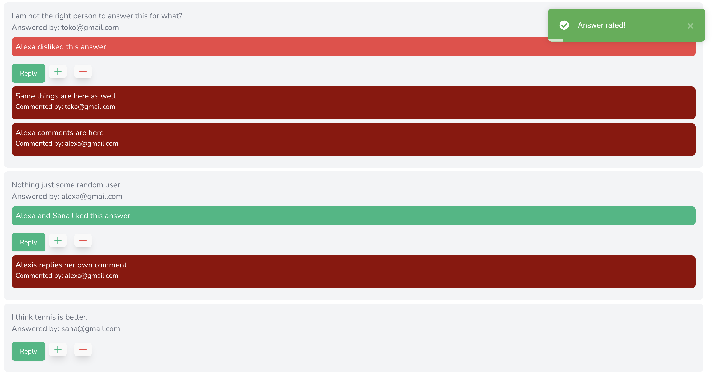

# Quora Clone

A Quora clone using Django and Vue. This was a hobby project I started a year ago. I've updated it recently and added many features which exist in Quora like questions, answers, comments, follow users, and rating questions and answers.

Learning by creating clones of popular websites is a great way to enhance your programming skills. By replicating the functionality of well-known platforms, you can gain a deeper understanding of the technologies and design patterns they use. This project helped me learn about Django's powerful features and Vue's reactive components, and how to integrate them to build a full-stack application.

# Technologies used

| Technology             | Description                                                                 |
|------------------------|-----------------------------------------------------------------------------|
| Python                 | A high-level programming language used for general-purpose programming.     |
| Django                 | A high-level Python web framework that encourages rapid development.        |
| Django Rest Framework  | A powerful and flexible toolkit for building Web APIs in Django.            |
| JavaScript             | A programming language commonly used to create interactive effects in web browsers. |
| Vue                    | A progressive JavaScript framework for building user interfaces.            |
| Swagger                | A tool for designing, building, and documenting RESTful APIs.               |
| Tailwind CSS           | A utility-first CSS framework for rapidly building custom user interfaces.  |
| Headless UI            | A set of completely unstyled, fully accessible UI components for React and Vue. |

# Updates

- 21st December - Initial release stable version.

# Features

- User authentication and authorization using JWT.
- Create, read, update, and delete questions and answers.
- Upvote and downvote answers.
- Follow and unfollow users.
- Search functionality to find questions and answers.
- Responsive design for mobile and desktop views.
- User profile management.
- RESTful API for integration with other services.
- Detailed documentation for API endpoints using Swagger docs.
- Unit and integration tests for critical components.

## Running the project

1. **Clone the repository:**
    ```bash
    git clone https://github.com/yourusername/quora_clone.git
    cd quora_clone
    ```

2. **Create a virtual environment:**
    ```bash
    python3 -m venv env
    source env/bin/activate  # On Windows use `env\Scripts\activate`
    ```

3. **Install the dependencies:**
    ```bash
    pip install -r requirements.txt
    ```

4. **Apply the migrations:**
    ```bash
    python manage.py migrate
    ```

5. **Create a superuser:**
    ```bash
    python manage.py createsuperuser
    ```

6. **Run the development server:**
    ```bash
    python manage.py runserver
    ```

7. **Navigate to the frontend directory and install dependencies:**
    ```bash
    cd client
    npm install
    ```

8. **Run the frontend development server:**
    ```bash
    npm run dev
    ```

9. **Open your browser and go to:**
    ```
    http://127.0.0.1:8000/  # For the Django backend
    http://localhost:8080/  # For the Vue frontend
    ```

# Deployment 

To deploy this project using Docker, follow these steps:

1. **Install Docker:**
    Make sure you have Docker installed on your machine. You can download it from [here](https://www.docker.com/products/docker-desktop).

2. **Create a `Dockerfile` for the backend:**
    ```dockerfile
    # Dockerfile
    FROM python:3.9-slim

    WORKDIR /app

    COPY requirements.txt requirements.txt
    RUN pip install -r requirements.txt

    COPY . .

    CMD ["python", "manage.py", "runserver", "0.0.0.0:8000"]
    ```

3. **Create a `Dockerfile` for the frontend:**
    ```dockerfile
    # client/Dockerfile
    FROM node:14

    WORKDIR /app

    COPY package.json package-lock.json ./
    RUN npm install

    COPY . .

    CMD ["npm", "run", "dev"]
    ```

4. **Create a `docker-compose.yml` file:**
    ```yaml
    version: '3.8'

    services:
      backend:
         build: .
         ports:
            - "8000:8000"
         volumes:
            - .:/app
         depends_on:
            - db

      frontend:
         build:
            context: ./client
         ports:
            - "8080:8080"
         volumes:
            - ./client:/app
         depends_on:
            - backend

      db:
         image: postgres:13
         environment:
            POSTGRES_DB: quora_clone
            POSTGRES_USER: user
            POSTGRES_PASSWORD: password
         volumes:
            - postgres_data:/var/lib/postgresql/data

    volumes:
      postgres_data:
    ```

5. **Run the Docker containers:**
    ```bash
    docker-compose up --build
    ```

6. **Access the application:**
    - Backend: `http://127.0.0.1:8000/`
    - Frontend: `http://localhost:8080/`

This setup uses Docker to containerize both the backend and frontend of the application, along with a PostgreSQL database. The `docker-compose.yml` file orchestrates the services, ensuring they are built and run together.

# Screenshots

The dashboard page where you can see all the latest questions.


Profile page where a user can update profile related details , change password and profile image which would be through a modal.


The question detail page where you can see all the answers and comments related to a given question.



This is user detail page where you can see statistics related to a user such as who is following this user, the number of questions posted and the answers provided by this user.


This picture shows the modal which opens while adding a new answer to a given question.


## License

This project is licensed under the MIT License. See the [LICENSE](LICENSE) file for more details.

# Contribute

We welcome contributions to improve this project! Here are some ways you can contribute:

1. **Report Bugs:**
    If you find any bugs, please report them by opening an issue on the GitHub repository.

2. **Suggest Features:**
    If you have ideas for new features or improvements, feel free to suggest them by opening an issue.

3. **Submit Pull Requests:**
    If you want to contribute code, follow these steps:
    - Fork the repository.
    - Create a new branch for your feature or bugfix.
    - Commit your changes and push the branch to your fork.
    - Open a pull request with a detailed description of your changes.

4. **Improve Documentation:**
    Help us improve the documentation by making it more comprehensive and easier to understand.

5. **Write Tests:**
    Ensure the codebase remains stable by writing unit and integration tests.

Please make sure to follow the project's code of conduct and contribution guidelines when contributing.

Thank you for your interest in contributing to this project!