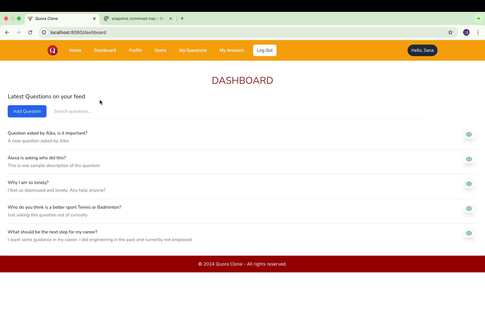

# Quora Clone

A Quora clone using Django and Vue.

# Technologies used

| Technology             | Description                                                                 |
|------------------------|-----------------------------------------------------------------------------|
| Python                 | A high-level programming language used for general-purpose programming.     |
| Django                 | A high-level Python web framework that encourages rapid development.        |
| Django Rest Framework  | A powerful and flexible toolkit for building Web APIs in Django.            |
| JavaScript             | A programming language commonly used to create interactive effects in web browsers. |
| Vue                    | A progressive JavaScript framework for building user interfaces.            |
| Swagger                | A tool for designing, building, and documenting RESTful APIs.               |
| Tailwind CSS           | A utility-first CSS framework for rapidly building custom user interfaces.  |
| Headless UI            | A set of completely unstyled, fully accessible UI components for React and Vue. |

# Updates

- 21st December - Initial release stable version.

# Features

- User authentication and authorization using JWT.
- Create, read, update, and delete questions and answers.
- Upvote and downvote answers.
- Follow and unfollow users.
- Search functionality to find questions and answers.
- Responsive design for mobile and desktop views.
- User profile management.
- RESTful API for integration with other services.
- Detailed documentation for API endpoints using Swagger docs.
- Unit and integration tests for critical components.

## Running the project

1. **Clone the repository:**
    ```bash
    git clone https://github.com/yourusername/quora_clone.git
    cd quora_clone
    ```

2. **Create a virtual environment:**
    ```bash
    python3 -m venv env
    source env/bin/activate  # On Windows use `env\Scripts\activate`
    ```

3. **Install the dependencies:**
    ```bash
    pip install -r requirements.txt
    ```

4. **Apply the migrations:**
    ```bash
    python manage.py migrate
    ```

5. **Create a superuser:**
    ```bash
    python manage.py createsuperuser
    ```

6. **Run the development server:**
    ```bash
    python manage.py runserver
    ```

7. **Navigate to the frontend directory and install dependencies:**
    ```bash
    cd client
    npm install
    ```

8. **Run the frontend development server:**
    ```bash
    npm run dev
    ```

9. **Open your browser and go to:**
    ```
    http://127.0.0.1:8000/  # For the Django backend
    http://localhost:8080/  # For the Vue frontend
    ```

# Screenshots

The dashboard page where you can see all the latest questions.



Profile page where a user can update profile related details , change password and profile image which would be through a modal.


The question detail page where you can see all the answers and comments related to a given question.


This is user detail page where you can see statistics related to a user such as who is following this user, the number of questions posted and the answers provided by this user.


This picture shows the modal which opens while adding a new answer to a given question.

